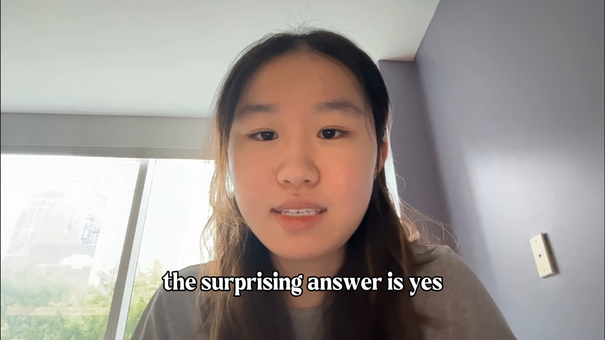

# MPATE-UE-1113 Final Project — Does AI-Generated Cantopop Respect Cantonese Tone?
by Candy Xie

A tone-tune mapping audit comparing human-sung Cantopop against Suno-generated Cantopop to test whether AI music generation respects Cantonese's six-tone system.

## Video (3:30)

[](https://youtu.be/GyHnrzyywV8)

## Question

Cantonese is a tonal language: the pitch direction between adjacent syllables has to roughly match the lexical tonal direction, or the lyric becomes unintelligible where a Cantonese listener might hear a completely different word, potentially resulting in misunderstanding. Wong & Diehl (2002) showed human Cantopop respects this rule **75–92%** of the time. **Does Suno?**

## Method

1. **Citation tones**: for each chorus snippet, look up every character's tone (1–6) in Words.hk and reduce to a 3-level target (High / Mid / Low) following Wong & Diehl.
2. **F0 extraction**: auto-segment each audio snippet into syllables, then use [Parselmouth](https://parselmouth.readthedocs.io/) (Python wrapper for Praat) to extract the fundamental frequency per syllable.
3. **Direction comparison**: for every adjacent syllable pair, compare *expected* tonal direction against *actual* F0 direction. Count violations.
4. **Pool comparison**: aggregate match rates across the 4-snippet human pool vs the 4-snippet Suno pool, and read both against Wong & Diehl's baseline.

## Dataset

**n = 8 chorus snippets** (4 human + 4 Suno-generated), all 10–14 syllables, drawn from the chorus of each track and matched by tempo. Audio in `final_project/audio/`.

| Tempo   | Human (track, artist, year)                                | Suno V5.5 (generated chorus)         |
| ------- | ---------------------------------------------------------- | ------------------------------------ |
| Mid     | 隔離 — Jace Chan (2023)                                    | 玻璃杯邊                              |
| Ballad  | 高山低谷 — Phil Lam 林奕匡 (2014)                         | 雨窗一封                                 |
| Ballad  | 在錯誤的宇宙尋找愛 — 陳健安 On Chan (2019)                | 平行失手                              |
| Uptempo | 紅日 — Hacken Lee 李克勤 (1992)                           | 旺角快車                              |

Snippet selection rules: chorus only, 10–14 syllables ending at a phrase boundary, no English loanwords, no proper nouns, citation tones cross-checked against Words.hk. Modern Cantopop register (literary 的, colloquial 嗎) is accepted on both sides.

## Files

- `final_project/pipeline/cantonese_tone_audit.py` — core framework: tone mapping, F0 extraction, violation counting
- `final_project/pipeline/audit_driver.py` — runs the audit across all 8 snippets, emits the comparison figure
- `final_project/audio/` — 4 human Cantopop tracks + 4 Suno-generated tracks (mp3 / wav)
- `final_project/figures/human_vs_suno.png` — bar chart of pool means by tempo with within-pool spread, against the Wong & Diehl baseline
- `final_project/figures/video_thumbnail.jpg` — poster frame for the video link at the top of the README

## Run

```bash
pip install praat-parselmouth librosa numpy pandas matplotlib
cd final_project/pipeline
python audit_driver.py
```

The driver normalizes its working directory to `final_project/` on startup, so audio and figure paths resolve correctly regardless of where the script is invoked from.

Outputs:
- `figures/human_vs_suno.png` — bar chart with pool means (n=4 each), individual snippet dots, and the Wong & Diehl baseline band
- per-snippet expected-direction tables and pair-by-pair violation reports to stdout
- top Suno violations grouped by track (b-roll material for the project video)

The CJK glyphs in matplotlib labels rely on a system CJK font (PingFang / Heiti / Hiragino — preinstalled on macOS). On Linux, install `fonts-noto-cjk` and add `'Noto Sans CJK TC'` to `matplotlib.rcParams['font.family']` near the top of `audit_driver.py`.

## Findings

The audit's headline number is counterintuitive: **Suno's pool mean (~80%) lands inside Wong & Diehl's 75–92% baseline; the human pool mean (~74%) is just below it.** That is almost certainly *not* a real Suno advantage — it is an artifact of auto-segmentation interacting with vocal articulation:

- Auto-segmentation is fragile. Moving the 玻璃杯邊 snippet boundary by **one second** swings its match rate by **18 points** (91% → 73%).
- Suno vocals have crisper consonant attacks than legato Cantopop human singing, giving the segmentation algorithm cleaner unvoiced gaps to split on. Better F0 windows → higher apparent match rate.
- The audit measures *direction-of-F0* only. It cannot hear timbre, lyrical depth, or whether a syllable's pitch contour is *natural* vs. *just-barely-correct-on-paper*.

The real finding is in the gap between what the audit measures and what a native Cantonese ear catches: surface accuracy (genre, language, chorus structure) without literary depth, with occasional tone-fit failures that flip word identity (係 → 西). Discussion and concrete failure pairs are walked through in the [accompanying video](#video-330).

---

# MPATE-UE-1113 Coursework

My personal work for NYU's *Music, Mind and Artificial Intelligence* course (Spring 2026). Python-based audio analysis, music information retrieval, and clustering — built around `librosa`, `music21`, `numpy`, and `scikit-learn`.

## Contents

- **`final_project/`** — Cantonese tone audit (see top of README for full writeup)
- **`labs/`** — Lab notebooks
  - `01-python-basics` · `02-hello` · `03-leap-year` — warm-ups
  - `04-sine-wave` · `05-sine-square-saw` · `06-play-audio` — synthesis & playback
  - `07-librosa-tempo` — tempo / beat tracking with librosa
- **`assignments/`** — Graded assignments
  - `01-written-1+2` — written responses
  - `02-librosa` — audio feature extraction
  - `03-clustering` — clustering songs by audio features
  - `04-playlisting` — playlist generation
  - `05-project-2` — project 2
- **`demos/`** — Side explorations (drum clustering, music21 analysis)
- **`notes/`** — Personal study notes (sine-wave fundamentals)
- **`misc/`** — Tempo-extraction tutorial I wrote up while reviewing for an assignment

## Setup

```bash
python3 -m venv .venv
source .venv/bin/activate
pip install jupyter librosa music21 numpy scikit-learn matplotlib
jupyter lab
```

## Note on course materials

This repo contains only my own work. Course materials authored by the instructor (lecture slides, assigned readings, lab handouts) are not included and are not redistributable.
